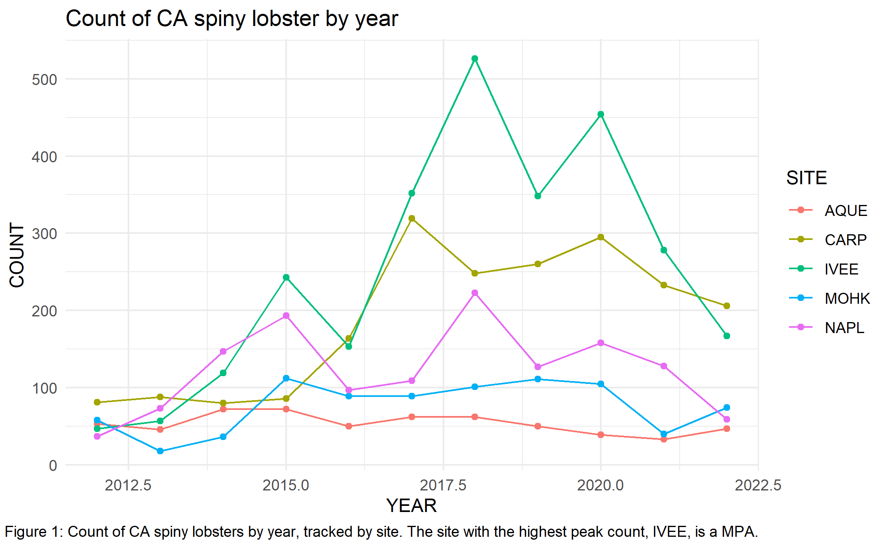
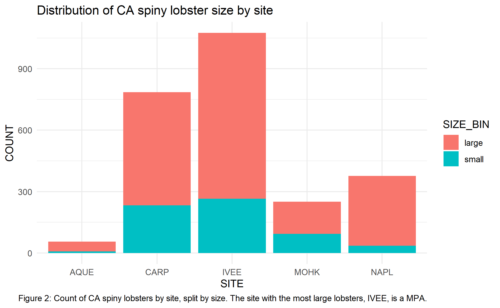

```{r}
library(readr)
library(dplyr)
library(ggplot2)
library(tidyr)
library(here)
```

## Introduction

The dataset used in this assignment was sourced from the EDI Data Portal and concerns the size and abundance of California spiny lobsters in Santa Barbara. Spiny lobsters are predators that serve as an essential predator species in kelp forests, and are a species that are harvested by humans for food. They are managed both as an indicator of kelp forest health and as a food source that can be overfished if too many adults of highly reproductive size are removed from the environment. This dataset contains size and abundance counts of spiny lobsters across sites and years, as well as trap counts by year and site.

Santa Barbara Coastal LTER, D. Reed, and R. Miller. 2022. SBC LTER: Reef: Abundance, size and fishing effort for California Spiny Lobster (Panulirus interruptus), ongoing since 2012 ver 8. Environmental Data Initiative. https://doi.org/10.6073/pasta/25aa371650a671bafad64dd25a39ee18 (Accessed 2026-04-13).

The data was downloaded here: <https://portal.edirepository.org/nis/mapbrowse?packageid=knb-lter-sbc.77.8> on April 13, 2026

# Owner Analysis

## Figure 1

{fig-alt="A line graph showing the count of spiny lobsters per site across years."}

## Figure 2

{fig-alt="A bar chart where the x axis is site and y axis is total count of lobsters. Each bar is divided by the number of small vs large lobsters."}

## Collaborator Analysis

```{r}

lobster_traps = read_csv(here::here("data/Lobster_Trap_Counts_All_Years_20210519.csv"))

```

## Here I plotted the total amount of lobster traps across the whole site from 2012 - 2021.

```{r}
lobster_traps = lobster_traps %>% 
    mutate(TRAPS = na_if(TRAPS, -99999))

unique(lobster_traps)
lobsters_traps_summarize = lobster_traps %>% 
  group_by(SITE, YEAR) %>% 
  summarize(TOTAL_TRAPS = sum(TRAPS, na.rm = TRUE))


#ggplot(data = lobsters_traps_summarize, aes(x = YEAR, y = TOTAL_TRAPS)) +
    #geom_point(aes(color = SITE)) 
ggplot(data = lobsters_traps_summarize, aes(x = YEAR, y = TOTAL_TRAPS)) +
    geom_point(aes(color = SITE)) 

```

fig 3. Total lobster traps at varying locations per year (2012 - 2021).

Next we looked at relative fishing pressure at each site.Fishing pressure has exactly or more than 8 traps, and a “low” fishing pressure has less than 8 traps (2019 - 2020).

```{r}
lobster_traps_fishing_pressure = lobster_traps %>% 
    filter(YEAR %in% c(2019, 2020, 2021)) %>%
    mutate(FISHING_PRESSURE = if_else(TRAPS >= 8, true = "high", false = "low")) %>%
    group_by(SITE, FISHING_PRESSURE) %>%
    summarize(COUNT = n()) %>%
    drop_na()
ggplot(data = lobster_traps_fishing_pressure, aes(x = SITE, y = COUNT, fill = FISHING_PRESSURE)) +
    geom_col() +
    labs(y = "Number of Segments per Site") +
    theme(axis.text.x = element_text(angle = 45, hjust = 1))
```

fig 4. Relative fishing pressure across each site. High = 8 or more traps; Low = fewer than 8 traps.

## Summary

Our analysis shows that particular sites contain very different sizes and numbers of lobsters in their surveyed populations. Across all sites, IVEE had the lowest fishing pressure, highest abundance of lobsters, and the largest lobsters. IVEE had low fishing pressure because it had no traps, which led to lobsters being able to reach larger sizes. CARP had the second highest number of large lobsters, and second highest abundance, and the highest number of traps from 2012-2020. 
